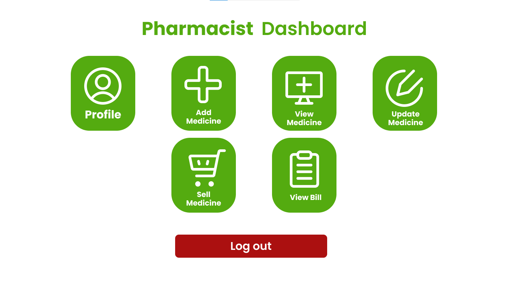
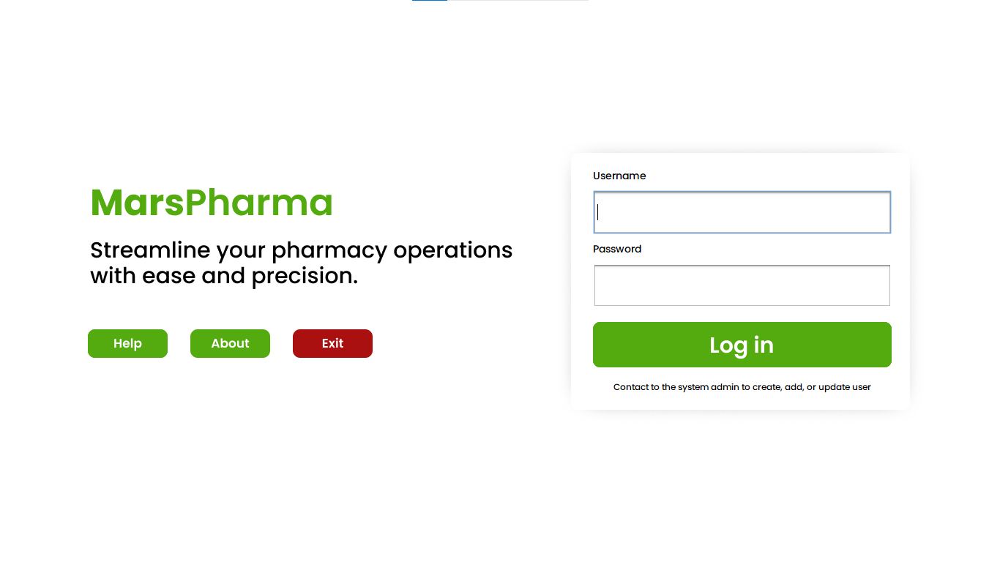
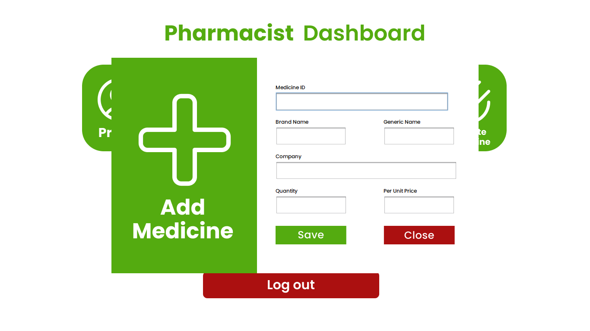
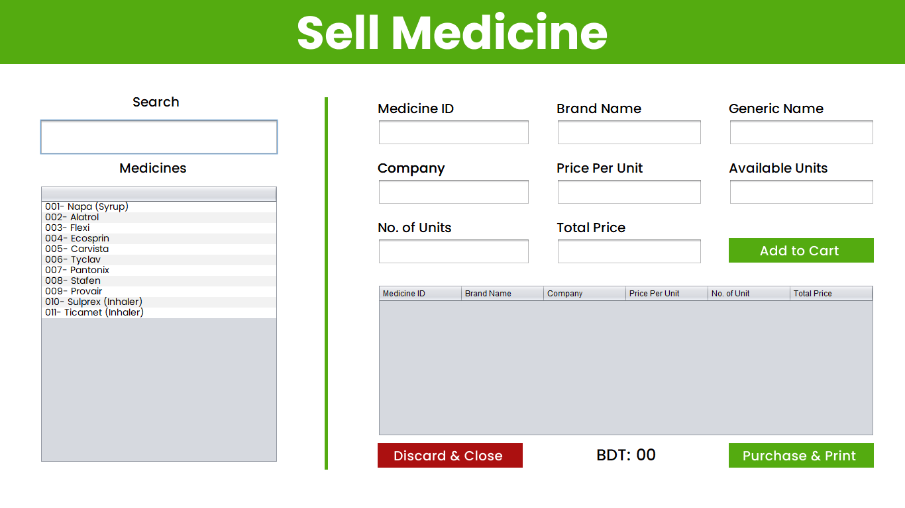
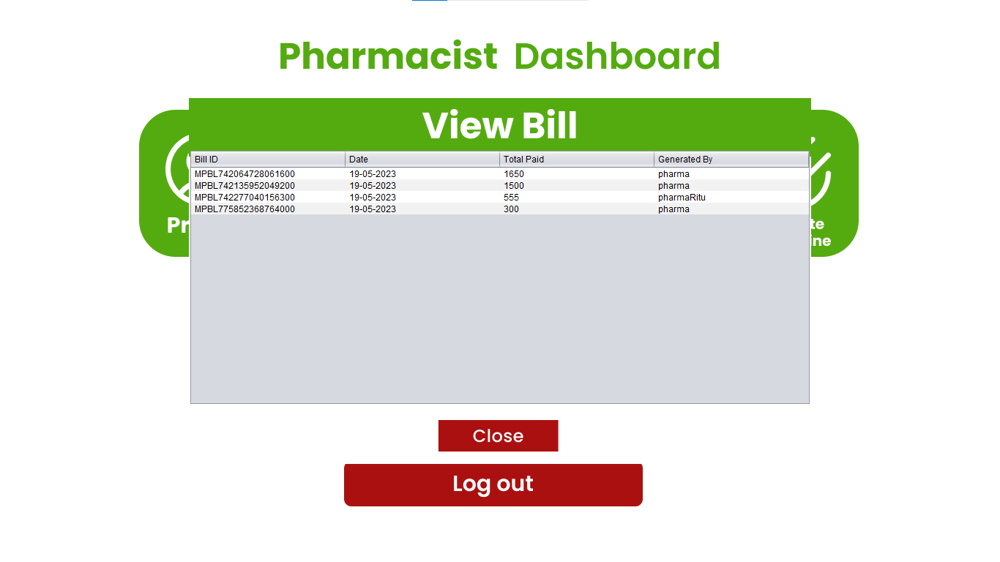
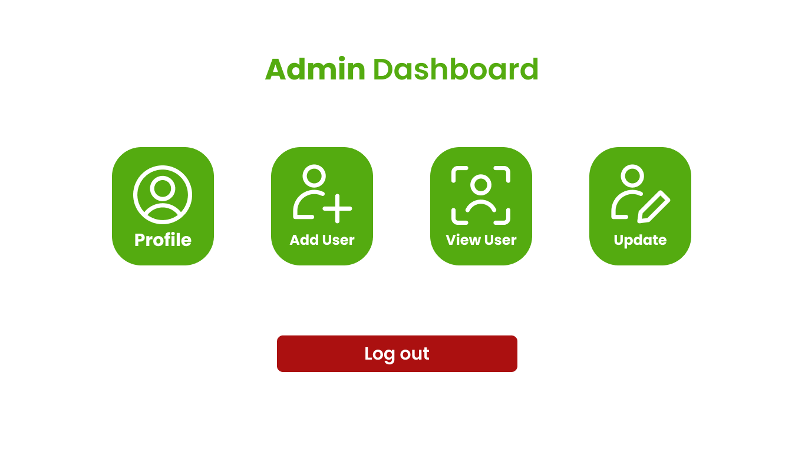
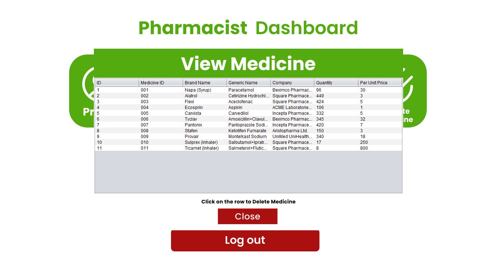
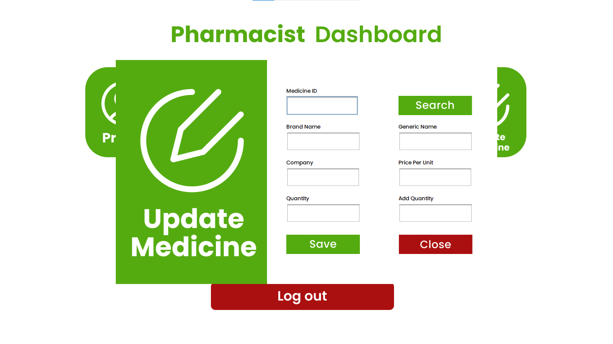
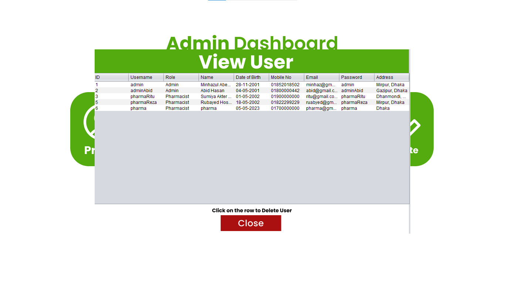
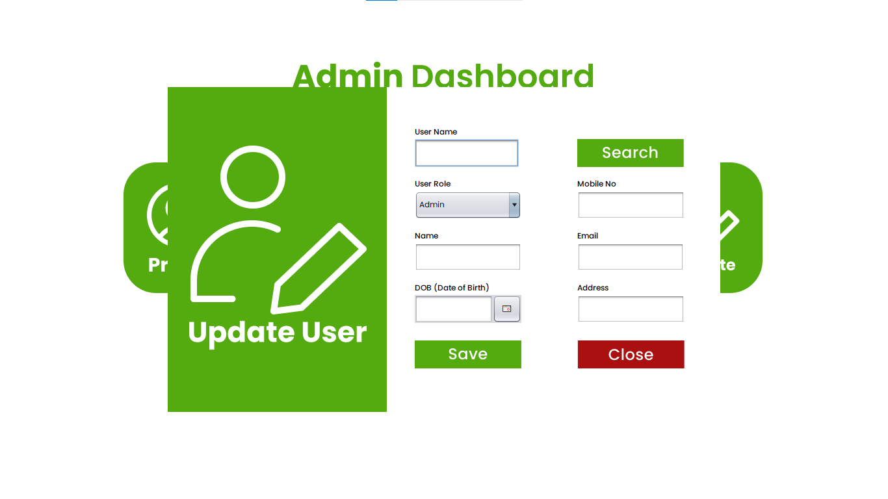

# MarsPharma

<div align="center">
  
  <p><em>A Comprehensive Solution for Streamlined Pharmacy Operations</em></p>
</div>

## 📋 Overview

MarsPharma is a robust Java-based pharmacy management system designed to streamline daily operations in pharmacies. It provides an intuitive interface for managing medicines, users, sales, and bills, making it easier for pharmacists and administrators to handle pharmacy operations effectively.

## ✨ Key Features

### 👤 User Management
- **Secure Authentication**: Role-based login system for administrators and pharmacists
- **User Administration**: Add, update, and manage user accounts with different access levels
- **Profile Management**: Users can view and update their personal information

<div align="center">
  
  <p><em>Secure login interface with role-based access control</em></p>
</div>

### 💊 Medicine Management
- **Inventory Control**: Add, update, and track medicine inventory
- **Search Functionality**: Quickly find medicines by brand name or unique ID
- **Stock Alerts**: Monitor low stock levels to ensure timely reordering

<div align="center">
  
  <p><em>Comprehensive medicine registration interface</em></p>
</div>

### 💰 Sales & Billing
- **Intuitive POS**: User-friendly point-of-sale interface for quick transactions
- **Cart System**: Add multiple medicines to a cart before checkout
- **Automatic Calculations**: Tax and total price calculations are handled automatically
- **PDF Receipts**: Generate and save professional PDF invoices for each transaction

<div align="center">
  
  <p><em>Streamlined sales interface for efficient transactions</em></p>
</div>

### 📊 Reporting & Analytics
- **Bill History**: Access and review all previous transactions
- **PDF Viewer**: Built-in functionality to view generated bills

<div align="center">
  
  <p><em>Comprehensive bill management and viewing system</em></p>
</div>

## 🖥️ Dashboard Interfaces

### Admin Dashboard

<div align="center">
  
  <p><em>Feature-rich dashboard for administrators with complete system control</em></p>
</div>

### Pharmacist Dashboard

<div align="center">
  
  <p><em>Focused dashboard for pharmacists with daily operation tools</em></p>
</div>

## 🛠️ Tech Stack

- **Language**: Java
- **UI Framework**: Java Swing with custom components
- **Database**: MySQL
- **PDF Generation**: iText library
- **Date Picker**: JCalendar
- **Charts**: JFreeChart
- **Database Connector**: MySQL Connector/J
- **Table Export**: RS2XML

## 📥 Installation & Setup

1. **Clone the repository**
   ```
   git clone https://github.com/yourusername/marspharma.git
   ```

2. **Import database**
   - Import the `marspharma.sql` file into your MySQL server
   - Default database name is `marspharma`

3. **Configure database connection**
   - Open `src/dao/ConnectionProvider.java`
   - Update the connection string, username, and password if necessary

4. **Configure PDF storage location**
   - Open `src/dao/PharmacyUtils.java`
   - Update the `billPath` variable to your preferred directory

5. **Run the application**
   - Execute the `Login.java` file to start the application
   - Default admin credentials: 
     - Username: admin
     - Password: admin123

## 📸 More Screenshots

<div align="center">
  
  
</div>

<div align="center">
  
  
</div>

## 👨‍💻 Author

Developed by **Minhazul Abedin** (ID: 221-15-4919)

## 📄 License

This project is open-source and available for educational and commercial use.

---

<div align="center">
  <p>© 2025 MarsPharma. All Rights Reserved.</p>
</div>
